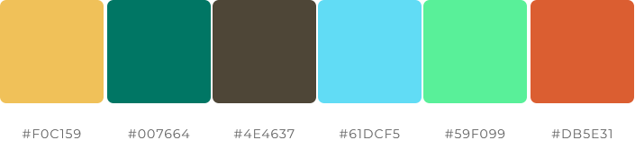
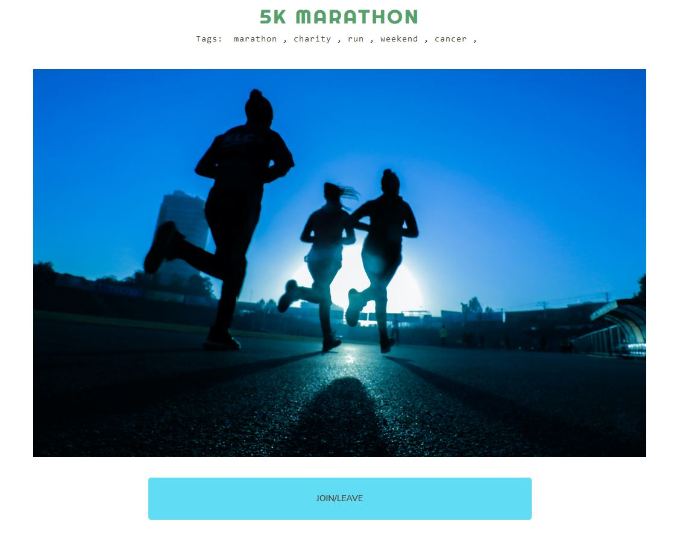

# Lets Meet!
[View the live project here](https://lets-meet.herokuapp.com/)

## Introduction
"Lets Meet" is a website designed to help people find their interest groups and meet new people! The website can be used by anyone planning an event, a trip, a hike, or anything and find people sharing their interests, and either join them or invite them to be a part of your own group.
You'll never need to do any activity alone if you don't want to! Just Sign-up, browse or post your interest and let others find you!


## Table of Content
 -  [UX/UI](#ux)
    - [Site Purpose](#purpose])
    - [Site Objectives](#objectives)
    - [Target Audience](#audience)
    - [User Stories](#stories)
    - [Design](#design)
        1. [Framework](#framework)
        1. [Schemas](#schemas)
        1. [Color](#color)
        1. [Typography](#typography)
 - [Features](#features)
    - [Present Features](#present)
        1. [Navbar](#nav)
        1. [Home Page](#home)
        1. [My Events Page](#my-events)
        1. [Meet/Events Detail Page](#event-detail)
        1. [Profile](#profile)
        1. [New Event/Meet](#new-event)
        1. [Sign-up/Log-in/Log-out](#sign-in)
    - [Features to Implement](#future)
 - [Testing](#testing)
 - [Technologies and Libraries Used](#tech)
 - [Deployment](#deployment)
 - [Acknowledgements and Credits](#credits)

<br><br>

# UX/UI <a name="ux"></a>
## Site Purpose <a name="purpose"></a>
The purpose of this website is to provide a platform for people who have difficulty finding people to join them for some activity or trips, maybe due to their friends not being interested or too busy to be able to join them. The website provides a way for people to find their interest groups, find people who share the same hobbies and interests, and meet new people, expand their social circle. A user can easily post their interests, an upcoming trip or excursion and others can join them as per their convenience and liking.
This website helps people to connect with each other and broaden their horizon.

## Site Objectives<a name="objectives"></a>
1. Provide an appealing and user friendly website.
1. Provide effective database mangement tools to the staffs.
1. Provide ease of navigation throughout the website.
1. Encourage more people to post their interes.
1. Help people find their interest gourps.

## Target Audience <a name="audience"></a>
1. People planning any event.
1. People looking for other like-minded people to meet.
1. People looking for interest groups.
1. People who might be free on weekends and looking for plans or events they can join.
1. For everyone who wants to try expand their social circle.

## User Story <a name="stories"></a>
- As a User, I can easily signup/register to the website so that I can browse the website freely.
- As a User, I can easily login, so that I can access the features of the website exclusive to logged in users.
- As a User I can easily determine whether I am logged in or not so that I can perform actions accordingly.
- As an Admin I can refresh access tokens so that users can remain logged in.
- As a User I can easily access the navigation bar from any page so that I can navigate through the website conveniently.
- As a User I can scroll through the page indefinitely so that I don't have to keep navigating to different pages.
- As a User I can create new events so that I can invite people to join or meet.
- As a User I can easily browse all the posted events so that I can find my interest group.
- As a User I can easily join an event/meet so that I can meet new people and join them.
- As a User I can easily find the details of an event so that I can plan my trips.
- As a User I can edit a post so that I can change the plans according to convenience.
- As a User I can delete an event so that I can remove my post.
- As a User I can post my opinion on an event/meet so that I can provide my feedback.
- As a User I can view the latest opinions so that I can see what other people have to say.
- As a User I can edit my posted opinion so that I can rectify any error in the opinion.
- As a User I can delete my opinions so that I can remove it from the post.
- As a User I can view my profile so that I can check my information.
- As a User I can edit my profile so that I can change any information as needed.
- As a User I can change my profile picture so that I can keep my profile updated.
- As a User I can view all the events I'm attending so that I can keep a note of the meets.
- As a User I can leave a meet easily so that I can change my plans.

<br>

 ### Current User Goals:
To keep users coming back again & again to see what new meets/events have been posted, as well as post their own interests to find other people to join them.
 <br />

 ### New User Goals:
To engage the user in a meaningful way, and encourage them to explore everything that the site has to offer.

<br><br>


<br>

## Design <a name="design"></a> <br>
 ### Framework <a name="framework"></a><br><br>
 
   #### Homepage: <br>
 
 <br><br>

   #### List of Meets Created and Attending: <br>
 
<br><br>

   #### Meet Detail Page: <br>
 
 <br><br>
   
   #### Profile Page: <br>
 
 <br><br>

## Database Schemas <a name="schemas"></a><br>


## Color Scheme <a name="color"></a><br>



<br><br>

## Typography <a name="typography"></a><br>
The fonts used in the website are:
  -  Dancing Script (Website Logo/Title)
  - Righteous (All the page headings)
  - Merriweather (Event Detail Paragraph)  

<br><br>

# Features <a name="features"></a>

## Present Features <a name="present"></a>

### Navbar <a name="nav"></a>
The navbar is conveniently constructed to display the website name, clicking on which would take you to the homepage. It also displays the links depending on the user viewing the website. If it's a new user, it will display the log-in link. If the user is logged in, the navbar dispalys the "Meets" link along with the "Home" link, which take the logged in user to "My-Meets" page where the user can view all the events they have created and the events they want to attend.

The nav-bar also dispalys the user's profile picture, which is a dropdown link. When clicked, it gives the user the options to either view their profile page or logout.

The navbar is also customised to wrap all the links into a burger menu for small-screen devices.
<br>

Nav-bar as seen by a logged-out user:

<br>

Nav-bar as seen by a logged-in user:

<br>

Mobile-device Menu:


<br>
<br>

### Homepage <a name="home"></a>
The homepage displays the list of all the created events by every user registered with the website. The list is beautifully displayed in form of cards, arranged in grids with 3 events/meets showing per row for big screens and 1 per row for mobile phones. The cards contain the image of the event, a title, a small catchy description, the date it was created along with the date of the event. The card also shows the name of the event creator and the number of people joining the event.

If a user is logged in, it gives the option to join the event/meet by simply clicking the "Join" button under the card. Whereas, the user has already joined the event, the button dispalys as such with the message, "Joined". If clicked, the button will take the user to the Event Detail page, where they can choose to leave the event if they wished.

This event detail page can also be reached by clicking on the image in the cards.

The events/meets are arranged on the homepage according to the time created, the latest being arranged at the top.
<br><br>

Homepage as seen by a logged-in user:


### My Events Page <a name="my-events"></a>
When clicked on "Meets" on the NavBar or upon clicking the "Join" button on the events card, the user is directed to the My Events page, where they can view all the events they have created or have opted to join. Here, the user can choose to edit/delete their created events or open up the Joined event for details and leave an opinion or leave the event as they wished.
<br>


<br>

### Meet/Event Detail Page <a name="event-detail"></a>
A user can easily check out the details of an event, as provided by the author, by clicking on the image of the event card. This directs the user to the Event Detail page. Here the user can check the details, see who all are joining the event (by clicking teh "Joining:" tag), read opinions or leave their own opinion about the meet/event. The user can also opt to join the event or leave it if already joined, by just clicking the button under the image.
<br><br>




<br><br>


### Profile <a name="profile"></a>
A user can easily access their profile by clicking on the profile picture on the NavBar, whic drops a menu with their name. Clicking on it, the user will be directed to the Profile Page, where they can view their information like Name, Email, Meets Attended, Phone Number. The user can choose to edit these informations by clicking on the "Edit" button. Here, they can also change their profile picture as per their convenience.

This page also displays all the events created by the user at the bottom of the page, so the user can keep track of the events they themselves created.
<br><br>

Profile Section:<br>

<br><br>

Created Events Section:<br>


<br><br>


### New Event/ Meet <a name="new-event"></a>
A user can easily create a new event/meet by clicking the "New Event" link on top of the page. This will direct the user to the New Event Screen, which offers a simple form to the user. It can be effortlessly filled and submitted and a new event is created in convenient steps. This newly created event can be kept a track of either on the Profile page or My Events Page, where the user can also edit or delete them.
<br><br>


<br><br>


### Sign-up/ Log-in/ Log-out <a name="sign-in"></a>
The user can easily sign in/register or signout using the option in the navbar.
<br>

Sign-up page:<br>


<br><br>

Sign-in page:<br>


<br><br>

Sign-out option:<br>


## Features to Implement <a name="future"></a>
In the future, given more time to work on the website, I would like to implement the following features:
- Follow another user who shares your interests so you can easily join their future events.
- Private messaging between users.
- Notification feature so a user can be notified whenever someone leave an opinion or join their event.
<br><br>


# Testing <a name="testing"></a>
## Manual Testing
1. Was having issues pushing code from VS Code to GitHub.
    - The api and the app was coded completely on VS Code and pushed to GitHub.
    - Faced a lot of issues while trying to push backend codes to GutHub after every few commits.
    - Due to this, frontend coding was first finished on VS Code, then complete code was pushed to teh GitHub in the end.
    - This led to fewer commits. Final touch was done on GitPod as it's easier to push the codes, helping in increasing the commits.

2. Attempts to login/register was throwing a connction error.
    - The frontend was not properly connected to the backend for authentication.
    - The url in CLIENT_ORIGIN in Config Vars on Heroku had a typo, which was corrected.

3. Initial issues connecting front-end and back-end
    - Procfile was not created.
    - Also, the Heroku prebuild line in the Json file was missing.
    - These were added accordingly and connected successfully.

4. Opinions were not being fetched properly.
    - There were some contradictions with the Event and Opinion models in the backend.
    - The model was changed slightly to eliminate this contradiction.

5. The cards were not showing the buttons properly.
    - Multiple buttons were being displayed, includin join, edit, delete, all in the same card.
    - The segragation for event cards on homepage and My Event page was not done properly.
    - Extra boolean variable, "joining" was used in teh Event.js to properly separate these displays.

6. Opinion edit/delete option was showing to every user, regardless of the opinion creator.
    - A boolean variable was created to determine the author of the opinion and display the option accordingly.

7. CRUD functionality has been tested thoroughly for following features:
    - Events/Meets
    - Opinions
    - Join (Only create/delete)
    - Profile (Edit only)

8. Nav links have been properly tested, and directs a user to intended landing pages.

9. Logged out user cannot access pages intended only for logged in users, properly tested with desired result.

10. Anyone can register successfully and login/logout without any errors.

11. A user is directed to a Page Not Found webpage when wrong url is entered.


## Validator Testings
  - CSS file passed through the [Jigsaw Validator](https://jigsaw.w3.org/css-validator/) without any reported issue.
    - Only minor errors and warnings thrown, which are majorly to do with the bootstrap's background css elements.
  <br><br>

  - The website has great Accessibility score in Lighthouse. There are minor fluctuations in the Performance score, as Bootstrap has some background css element issues.
  <br><br>

     

  - Javascript files passed through [ESLint](https://eslint.org/). There were minor issues with "class" used for FontAwesome element. 

  - Tested on several browsers, including the standart Mozilla Firefox, Chrome and Safari. The website runs smoothly on all the browsers.


## Unfixed Bugs
  No bugs were found as of writing of this document. Any bug found during the development and deployment of the project was worked on and removed.

<br><br>

# Technologies And Libraries Used <a name="tech"></a>

- ## Languages
    1. [HTML5](https://en.wikipedia.org/wiki/HTML5)
    2. [CSS](https://en.wikipedia.org/wiki/CSS)
    3. [JavaScript](https://en.wikipedia.org/wiki/JavaScript)
    4. [Python](https://en.wikipedia.org/wiki/Python_(programming_language))
  
- ## Database
    1. [PostgreSQL](https://www.postgresql.org/)

- ## Frameworks
    1. [Django-Rest Framework](https://www.django-rest-framework.org/) - Python Framework
    2. [ReactJS](https://reactjs.org/) - JavaScript Framework
    3. [ReactJS-Bootstrap](https://react-bootstrap.github.io/) - CSS Framework
    4. [Simple JWT](https://django-rest-framework-simplejwt.readthedocs.io/en/latest/)

- ### Hosting Platforms/Other Platforms
    1. [Heroku](https://www.heroku.com)
    2. [Cloudinary](https://cloudinary.com)
    3. [GitHub](https://github.com)
    4. [VS Code](https://code.visualstudio.com/)
    5. [GitPod](https://gitpod.io)
    6. [ElephantSQL](https://www.elephantsql.com/)

- ### Supporting Programs/Softwares
    1. Balsamiq
    2. [DrawSQL](https://drawsql.app)
    3. [Google Fonts](https://fonts.google.com/)
    4. [Font Awesome](https://fontawesome.com/)


# Deployment <a name="deployment"></a>
The website was deployed on Heroku. The steps are as follows:

1. Launch the GitPod workspace.
2. Install ReactJS:

```
npx create-react-app . --use-npm
npm start
```

3. Install the following packages using the command ``npm install``:
```
react-bootstrap@1.6.3 bootstrap@4.6.0
react-router-dom@5.3.0
axios
react-infinite-scroll-component
msw --save-dev
jwt-decode
-g eslint
```

4. Create the project app on Heroku, and link the GitHub repository by navigating to the 'Deploy' tab.

## Connecting the API:

- Navigated to the Heroku app of the project DRF-API, and under the Settings tab, added the following configvars:
  - Key: CLIENT_ORIGIN | Value
  - Key: CLIENT_ORIGIN_DEV | Value

- Check that the trailing slash ``\`` at the end of both links has been removed, and save the configvar pairs.
- Install the Axios package, & create supporting ``axiosDefaults.js`` as shown in Moments Walkthrough.

## Deploy To Heroku:
1. In the ``scripts`` section of ``package.json`` in gitpod, added the following command:
``"heroku-prebuild": "npm install -g serve",``

2. Add Procfile to project root & populate with the following:
``web: serve -s build``

3. Repeat the steps of git add/commit/push.
4. Deploy the project via the deploy button on Heroku.


# Acknowledgements and Credits <a name="credits"></a>
- All the images used on the website were taken from [Unsplash](https://unsplash.com/).
- The project relied heavily on YouTube tutorials and Udemy course, rather than the course content itself, due to the poor quality of the course.
- Several documents were used for the production:
  - [ReactJS Documentation](https://reactjs.org/docs/getting-started.html)
  - [React-Bootstrap Documentation](https://react-bootstrap.github.io/)
  - [Simple JWT Documentation](https://django-rest-framework-simplejwt.readthedocs.io/en/latest/)
  - [Redux Documentation](https://redux.js.org/)
  - [Axios Documentation](https://axios-http.com/docs/intro)
- Huge thanks to the CodeInstitute Tutors for their valuable help and support.
- Great appreciation for my mentor Martina Terlevic, for her constant support.
